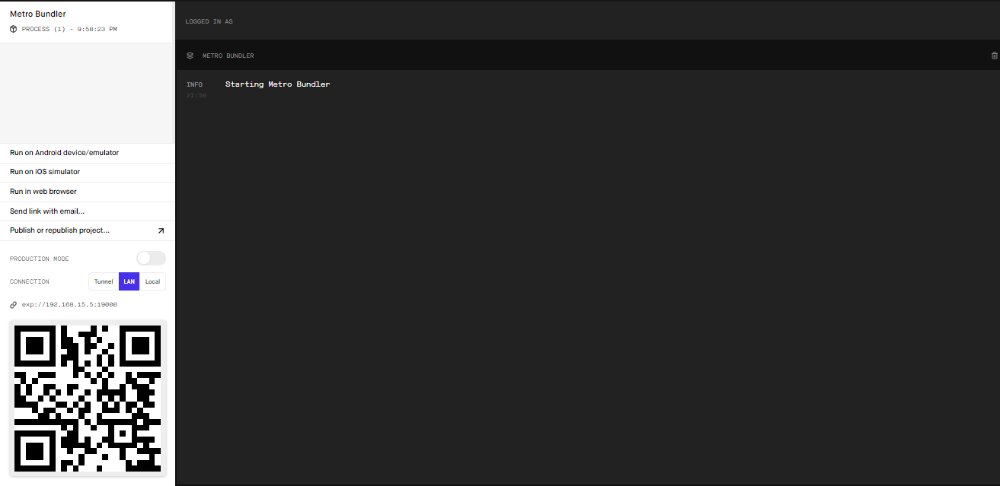

# ONEBITHEALTH

Esse é um app mobile desenvolvido como meus primeiros passos com React Native baseado em um minicurso básico da onebitcode sobre essa biblioteca do JavaScript.

É uma aplicação que simplesmente calcula o IMC baseado no peso e na altura inseridos, e então mostra os resultados.

## As técologias usadas nesta aplicação foram:

- As funcionalidades básicas da bilioteca React Native
- Algumas das API's que a biblioteca fornece, como Vibration e Share
- Expo

## Modo de uso

Primeiramente abra o terminal e navegue até a parta deste projeto, depois basta digitar "yarn start" e esperar a página web com o código QR ser carregada.

Então você precisa baixar o aplicativo da Expo no celulcar caso use Android, caso use IOS, basta escanear o código QR com a câmera do celular.

E pronto, o projeto já esta rodando no seu celular.
